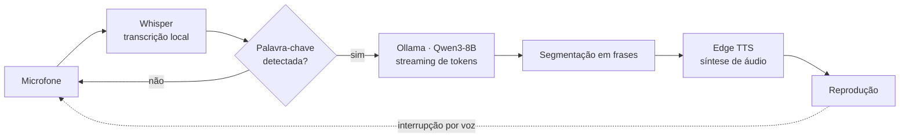

<div align="center">

# Assistente de Voz

**Assistente de voz local, contínuo e em tempo real — em português do Brasil**

Fala com você, ouve enquanto fala, e você pode interrompê-lo no meio da frase — como numa conversa real.


</div>

---

## Sobre o projeto

Este é um assistente de voz que roda inteiramente na sua máquina: você fala, ele transcreve, pensa e responde em voz — sem depender de nenhuma nuvem para entender ou gerar a resposta.

A ideia central foi eliminar a sensação de "falar com um bot": a resposta começa a ser falada assim que a primeira frase do modelo fica pronta (sem esperar o texto inteiro), e o assistente pode ser interrompido a qualquer momento, exatamente como aconteceria numa conversa entre pessoas.

**Pipeline:** microfone → Whisper (transcrição local) → Ollama / Qwen3-8B (raciocínio, em streaming) → Edge TTS (fala)

## Funcionalidades

| Funcionalidade | Descrição |
|---|---|
| Ativação por nome | Fica em modo de espera até ouvir a palavra-chave configurada, então entra em conversa ativa |
| Resposta em streaming | Começa a falar a primeira frase assim que ela fica pronta, enquanto o restante da resposta ainda está sendo gerado |
| Interrupção natural | Falar por cima do assistente corta a fala dele na hora, usando detecção de voz (VAD) combinada com limiar de volume para ignorar ruído de fundo |
| Configuração por voz | Na primeira execução, pergunta (falando) a voz e o nome desejados, e memoriza a escolha |
| Troca em tempo real | Comandos de voz como "mudar a voz" ou "mudar o nome" ajustam o assistente em qualquer momento da conversa |
| Painel visual | Janela com um círculo animado que reflete o estado atual: dormindo, ouvindo, pensando ou falando |

## Arquitetura



Durante a reprodução, uma thread separada monitora o microfone com Silero VAD: uma interrupção só é confirmada quando há voz humana detectada (não ruído) e volume compatível com alguém falando perto do microfone — isso evita que conversas de fundo ou barulhos cortem o assistente por engano.

## Stack técnica

- **Transcrição (STT):** [OpenAI Whisper](https://github.com/openai/whisper) (local, com aceleração CUDA)
- **Modelo de linguagem:** [Ollama](https://ollama.com) rodando [Qwen3-8B](https://ollama.com/library/qwen3)
- **Síntese de voz (TTS):** [Edge TTS](https://github.com/rany2/edge-tts)
- **Detecção de fala (VAD):** [Silero VAD](https://github.com/snakers4/silero-vad)
- **Interface visual:** Pygame
- **Áudio:** PyAudio + SpeechRecognition

## Como executar

### 1. Pré-requisito: Ollama

O [Ollama](https://ollama.com) é o runtime que serve o modelo de linguagem localmente. É o requisito mínimo do projeto — sem ele, o assistente não gera respostas.

- **Instalação:** [ollama.com/download](https://ollama.com/download) · **Documentação oficial:** [docs.ollama.com](https://docs.ollama.com)
- **Sistema operacional mínimo:** Windows 10 22H2+, macOS 11 (Big Sur)+ ou Linux (ex.: Ubuntu 18.04+)
- **RAM mínima:** 8 GB (16 GB recomendado)
- **Disco:** ~4 GB para o Ollama + ~5,2 GB para o modelo `qwen3:8b`
- **GPU:** opcional, mas recomendada para modelos de 7B+ parâmetros (roda em CPU se não houver GPU, porém mais lento). Com GPU NVIDIA, é preciso compute capability 5.0+; o runtime CUDA já vem embutido no Ollama.

Após instalar, baixe o modelo:

```bash
ollama pull qwen3:8b
```

### 2. Dependências Python

```bash
pip install -r requirements.txt
```

> O `torch` do `requirements.txt` é a versão padrão (CPU) do PyPI. Para usar GPU/CUDA na transcrição (recomendado — ver `WHISPER_DEVICE`), instale o `torch` separadamente seguindo [pytorch.org/get-started/locally](https://pytorch.org/get-started/locally/) antes de instalar o restante das dependências.

### 3. Executar

```bash
python voice_chat.py
```

Na primeira execução, o assistente calibra o ruído ambiente (fique em silêncio por um instante) e pergunta, falando, a voz e o nome desejados. Depois disso, basta dizer o nome escolhido para ativá-lo.

`Ctrl+C` encerra o programa.

## Estrutura do projeto

```
voice-assistant/
├── voice_chat.py      # pipeline completo: config, transcrição, LLM, TTS, loop principal
├── ui_visual.py        # painel visual (janela pygame com o círculo animado)
├── config.json          # voz e nome do assistente escolhidos pelo usuário (não versionado)
└── requirements.txt   # dependências Python
```

## Ajustes finos

A maior parte do comportamento é controlada por constantes no início de `voice_chat.py`:

| Constante | Controla |
|---|---|
| `MODEL`, `WHISPER_MODEL`, `WHISPER_DEVICE`, `BEAM_SIZE` | modelo de linguagem e transcrição |
| `FEMALE_VOICE`, `MALE_VOICE` | vozes do Edge TTS |
| `MIC_NAME` | qual microfone usar (por trecho do nome do dispositivo) |
| `VAD_THRESHOLD`, `VAD_CONSECUTIVE_FRAMES`, `INTERRUPTION_VOLUME_MULTIPLIER` | sensibilidade da detecção de interrupção |
| `MIN_CHUNK_SIZE`, `MAX_CHUNK_SIZE`, `MIN_FIRST_CHUNK_SIZE`, `MAX_FIRST_CHUNK_SIZE` | tamanho dos trechos de texto sintetizados em áudio |
| `STOP_PHRASES`, `CHANGE_VOICE_PHRASES`, `CHANGE_NAME_PHRASES` | frases reconhecidas como comandos de voz |
| `SYSTEM_PROMPT` | personalidade e estilo de resposta do assistente |

---
